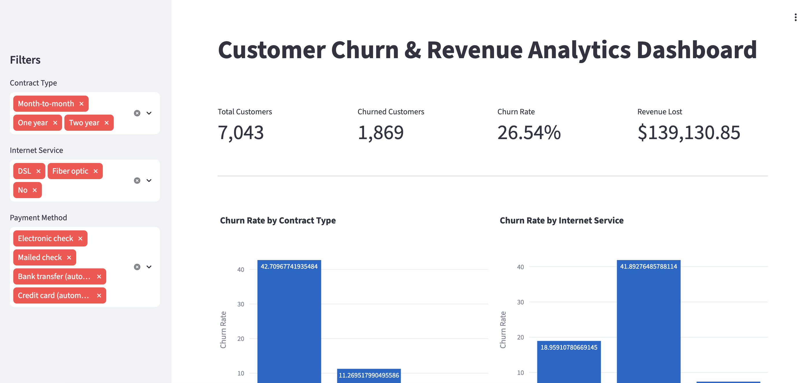
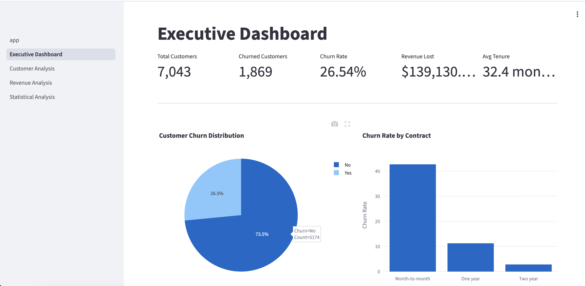
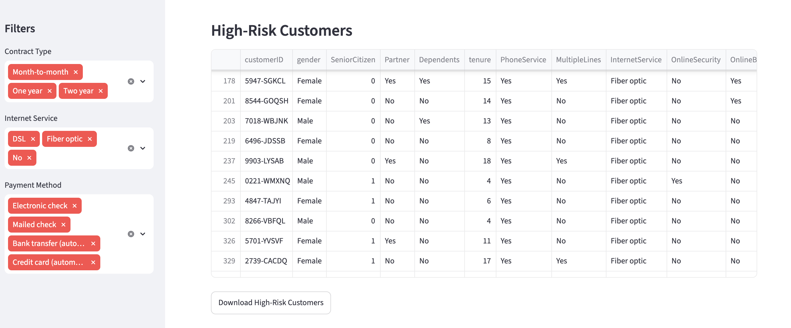

# 📊 Customer Churn & Revenue Analytics

An end-to-end Data Analytics project that analyzes customer churn using **Python, SQL, Statistical Analysis, Machine Learning, and Streamlit**. The project identifies churn drivers, estimates revenue loss, predicts customer churn, and provides actionable business recommendations through interactive dashboards.

---

# 📌 Business Problem

Customer churn is one of the biggest challenges faced by subscription-based businesses. Losing customers directly impacts recurring revenue and business growth.

This project aims to:

- Identify customers who are likely to churn
- Analyze the factors influencing churn
- Quantify revenue loss
- Validate business assumptions using statistical testing
- Predict churn using machine learning
- Provide actionable insights through interactive dashboards

---

# 📂 Dataset

**IBM Telco Customer Churn Dataset**

- 7,043 Customers
- 21 Original Features
- Customer Demographics
- Account Information
- Internet Services
- Payment Methods
- Churn Status

Dataset:
https://www.kaggle.com/datasets/blastchar/telco-customer-churn

---

# 🛠 Technologies Used

### Programming

- Python

### Data Analysis

- Pandas
- NumPy

### Data Visualization

- Matplotlib
- Seaborn
- Plotly

### Statistical Analysis

- SciPy
- Statsmodels

### Machine Learning

- Scikit-Learn
- XGBoost

### Database

- SQLite
- SQL

### Dashboard

- Streamlit

---

# 📁 Project Structure

```text
customer-churn-analytics/

│

├── dashboard/
│   ├── app.py
│   └── pages/
│       ├── 1_Executive_Dashboard.py
│       ├── 2_Customer_Analysis.py
│       ├── 3_Revenue_Analysis.py
│       ├── 4_Statistical_Analysis.py
│       └── 5_Machine_Learning.py
│
├── data/
│   ├── raw/
│   └── processed/
│
├── notebooks/
│   ├── 01_data_cleaning.ipynb
│   ├── 02_eda.ipynb
│   ├── 03_statistics.ipynb
│   ├── 04_machine_learning.ipynb
│   ├── 05_sql_analysis.ipynb
│   └── 06_business_insights.ipynb
│
├── reports/
│   └── business_report.md
│
├── sql/
│   └── churn_queries.sql
│
├── src/
│   └── load_data.py
│
├── images/
│
├── customer_churn.db
│
├── requirements.txt
│
└── README.md
```

---

# 🔄 Project Workflow

Raw Dataset

↓

Data Cleaning

↓

Exploratory Data Analysis

↓

Statistical Analysis

↓

SQL Business Analysis

↓

Machine Learning

↓

Interactive Dashboard

↓

Business Insights

---

# 📊 Exploratory Data Analysis

Performed comprehensive exploratory analysis including:

- Missing Value Analysis
- Duplicate Detection
- Feature Engineering
- Customer Demographics
- Revenue Trends
- Contract Analysis
- Internet Service Analysis
- Payment Method Analysis
- Correlation Analysis

---

# 📈 Statistical Analysis

The following statistical techniques were used:

### Independent t-Test

Validated whether monthly charges differ significantly between churned and retained customers.

### Chi-Square Test

Measured the relationship between contract type and churn.

### ANOVA

Compared monthly charges across different internet service types.

### Correlation Analysis

Analyzed relationships among numerical variables.

### Confidence Interval

Estimated confidence interval for average monthly charges.

---

# 💾 SQL Analysis

More than **30 business SQL queries** were written to answer important business questions.

Examples include:

- Overall Churn Rate
- Revenue Analysis
- Customer Segmentation
- Churn by Contract
- Churn by Payment Method
- Churn by Internet Service
- High-Risk Customer Identification
- Revenue Lost Due to Churn
- Customer Lifetime Value

---

# 🤖 Machine Learning

Three machine learning models were developed.

- Logistic Regression
- Random Forest
- XGBoost

Evaluation Metrics

- Accuracy
- Precision
- Recall
- F1 Score
- ROC-AUC

---

# 📊 Interactive Dashboard

The project includes a multi-page Streamlit dashboard.

Dashboard Pages

- Home
- Executive Dashboard
- Customer Analysis
- Revenue Analysis
- Statistical Analysis
- Machine Learning

Dashboard Features

- KPI Cards
- Interactive Filters
- Revenue Analysis
- Customer Segmentation
- Statistical Test Results
- Feature Importance
- High-Risk Customer List

---

# 📷 Dashboard Preview

### Home



### Executive Dashboard



### Customer Analysis



---

# 📈 Key Business Insights

- Month-to-month customers have the highest churn rate.
- Fiber optic customers churn significantly more than DSL customers.
- Customers with higher monthly charges are more likely to churn.
- Customers with lower tenure are more likely to churn.
- Contract type has a statistically significant relationship with churn.
- Machine learning models successfully identify high-risk customers.

---

# 💡 Business Recommendations

- Promote long-term contracts.
- Improve customer experience for Fiber Optic users.
- Offer retention incentives to high-risk customers.
- Deploy predictive churn monitoring.
- Focus marketing campaigns on customers with high churn probability.

---

# 🚀 How to Run

Clone the repository

```bash
git clone https://github.com/Rahul-Kanagaraj/customer-churn-analytics.git
```

Install dependencies

```bash
pip install -r requirements.txt
```

Create SQLite database

```bash
python src/load_data.py
```

Run Streamlit

```bash
streamlit run dashboard/app.py
```

---

# 🔮 Future Improvements

- Deep Learning Models
- SHAP Explainability
- Customer Lifetime Value Prediction
- Time-Series Forecasting
- Real-Time Churn Prediction API
- Cloud Deployment

---

# 👨‍💻 Author

**Rahul Raj Kanagaraj**

GitHub

https://github.com/Rahul-Kanagaraj

LinkedIn

https://www.linkedin.com/in/rahul-raj-kanagaraj-4435b7402

## Live Dashboard

[Open Streamlit Dashboard](https://customer-churn-analytics-ttujwtcbia9xvuchp73snz.streamlit.app/)